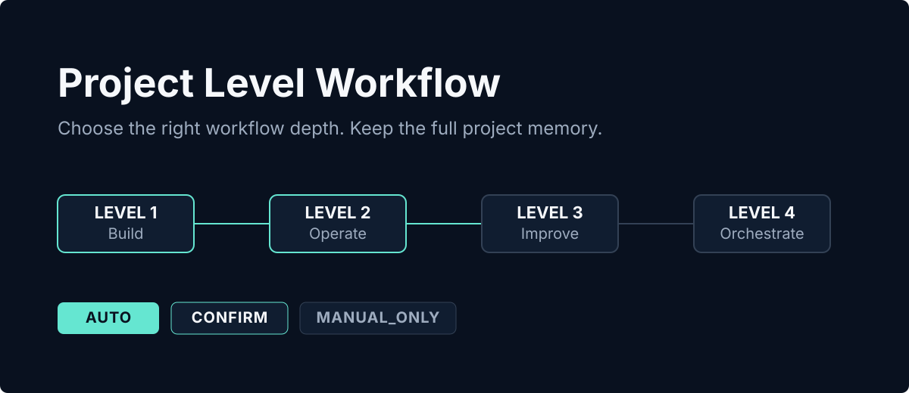
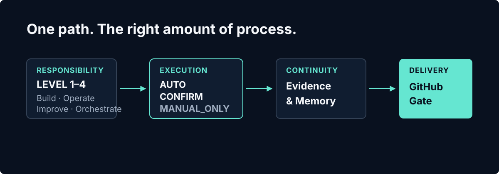

# Project Level Workflow

<p align="right"><a href="README.en.md">English</a></p>



为个人开发者而设的四级项目工作流。它让 LEVEL 1 / LEVEL 2 优先，把普通进度留在 `AUTO`，只在真正重要的决定前进入 `CONFIRM` 或 `MANUAL_ONLY`。

## 3 分钟快速开始

下面以 Windows、Codex、项目级安装和 LEVEL 1 为例。先审查 Dry Run；确认 LEVEL 后，再初始化项目。

```powershell
git clone https://github.com/Ee1ex/project-level-workflow.git
Set-Location project-level-workflow

$ProjectPath = 'D:\path\to\your-project'
./scripts/install.ps1 -Platform codex -Scope project -ProjectPath $ProjectPath -DryRun
./scripts/install.ps1 -Platform codex -Scope project -ProjectPath $ProjectPath

python "$ProjectPath\.codex\skills\project-level-workflow\scripts\workflow.py" init --project $ProjectPath --level 1
python "$ProjectPath\.codex\skills\project-level-workflow\scripts\workflow.py" status --project $ProjectPath
```

初始化会建立 `.project-workflow/state.json` 和 `docs/project-workflow/STATUS.md`。其他平台与安装范围见下方说明；四个 LEVEL 的完整规则以 [`LEVEL.md`](LEVEL.md) 为唯一权威源。

## 它如何工作



1. **责任决定深度。** 先判断你是在快速构建、持续运营、改进已有仓库，还是编排复杂自动化。
2. **风险决定暂停点。** LEVEL 1–3 对用户只展示 `AUTO`、`CONFIRM`、`MANUAL_ONLY`；普通实现、测试和本地提交不形成 Gate。
3. **证据形成记忆。** 目标、架构和当前事实保持稳定；决定、修改和验证持续累积，下一次可以从事实继续。
4. **公开交付单独确认。** Push、PR、Merge、Tag 和 Release 自动路由 Codex GitHub 插件，执行前集中确认，完成后远端回读验证。

## 选对 LEVEL

| LEVEL | 责任模式 | 适合什么项目 | 默认做法 |
| --- | --- | --- | --- |
| **1** | 快速开发与完整项目记忆 | 离线工具、脚本、Skill、插件、Mod、原型、静态页面、版本化下载物 | 实现 → 运行 → 观察 → 调整；小改动只留轻量记录 |
| **2** | 完整 PVS 持续运营 | 自己负责账户、权限、云端数据、服务、部署、备份、回滚、监控或支持 | 全量包内 PVS；`Phase 0 → Phase N`、范围冻结和 DoD，普通 Phase 完成后自动继续 |
| **3** | 已有、团队与开源项目改进 | 参与他人、团队、公司或开源仓库 | 复用 Issue、PR、CHANGELOG、ADR；只补项目地图、Change Record、基线、回归与交接 |
| **4** | 复杂自动化参考与路由 | 大型产品、多系统编排、复杂自动化和多人协作 | 先分析，负责人确认后可实施；十节点作参考，外部专业 Skill 只路由、不内嵌 |

选择顺序很简单：已有或协作仓库优先 LEVEL 3；需要线上运行和持续运营选 LEVEL 2；离线、静态或可下载交付物默认 LEVEL 1；大型多系统编排再考虑 LEVEL 4。

“以后会更新”不等于“持续运营”。重新打包或上传静态版本通常仍是 LEVEL 1；只有长期承担可用性、用户、权限、数据、发布和支持责任时，才通常进入 LEVEL 2。

## 双层项目记忆

项目记忆不是文档数量，而是两类信息都能被接管：

- **稳定认知层**回答“项目现在是什么”：目标、范围、核心路径、架构、模块、调用、数据、依赖、构建、测试和交付。
- **演进记录层**回答“为什么变成这样”：Requirements、Decisions、Progress、Bug、CHANGELOG、Release Record 和验证证据。

LEVEL 1 同时建立两层记忆，但小功能、小修改只需要 Progress/Changelog 或轻量 Change Record。LEVEL 2 全量采用包内 PVS，覆盖产品、需求、决策、业务流、UI、架构、API、数据、权限、部署、监控、备份、回滚、运营、Bug、待验证和版本记录。LEVEL 3 优先复用仓库既有事实，不另建平行文档树。

完整治理规则和 starter 模板内嵌在 [`core/project-vibe-spec/PVS.md`](core/project-vibe-spec/PVS.md)，职责映射见 [`templates/template-map.json`](templates/template-map.json)；安装本包不需要再下载第二个 PVS Skill。

## 兼容、安全与 GitHub 交付

`1.0` 使用 workflow `1.0` 与 schema `2.0`。读取和迁移兼容历史 `0.4.0` 三段状态，安全刷新后只写两段公共版本 `X.X`。迁移前写入 `state.backup.json`；`0.4.0` 的 LEVEL 1–4 保持原数字，其中旧 LEVEL 4 仍停在分析边界并等待执行确认。更老状态按协议迁移：旧 LEVEL 1 → 新 LEVEL 1、旧 LEVEL 2 → 新 LEVEL 3、旧 LEVEL 3 → 新 LEVEL 4。

以下动作始终需要确认：批量删除、生产数据、密钥、支付、账号权限、不可逆迁移、安全降级、生产部署、公开发布、对外发送、Merge 和 Release。Force Push 与改写公共历史禁止。

所有 LEVEL 的 GitHub 交付都使用同一契约：插件先只读核对远端，给出分支、提交、文件范围、测试证据、PR、Merge、Tag/Release、回滚和未验证项，再请求一次远程操作确认。成功提示不等于完成；必须用 GitHub 插件回读结果。

## 平台、开发验证与许可证

支持 Codex、Claude Code 和 Cursor：

```powershell
./scripts/install.ps1 -Platform codex -Scope user -DryRun
./scripts/install.ps1 -Platform cursor -Scope project -ProjectPath 'D:\path\to\project' -DryRun
```

```sh
./scripts/install.sh --platform claude-code --scope user --dry-run
./scripts/install.sh --platform claude-code --scope user
```

适配器只引用当前 LEVEL、状态和分层策略，不复制完整流程。更新器会先运行 Doctor，并在替换旧安装前迁移项目状态和创建时间戳备份；卸载器只移除托管 Skill，默认保留 `.project-workflow/` 与 `docs/project-workflow/`。

开发验证只依赖 Python 3.10+ 标准库：

```sh
python -m unittest discover -s tests -v
python scripts/workflow.py doctor --package-root .
python scripts/workflow.py validate-package --package-root .
```

当前公共版本为 `1.0`，Git Tag 为 `v1.0`。项目采用 [MIT License](LICENSE)。
